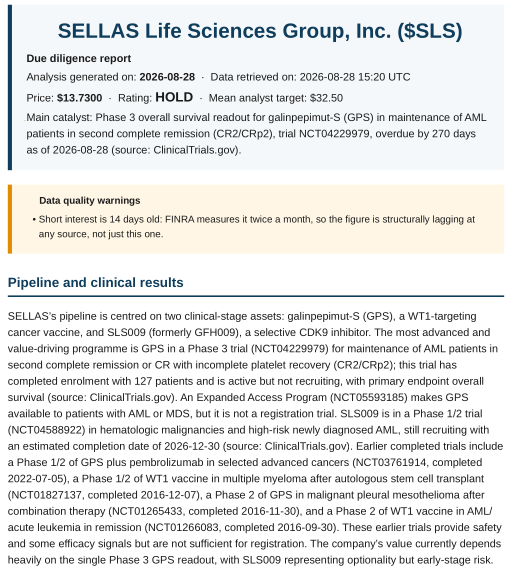
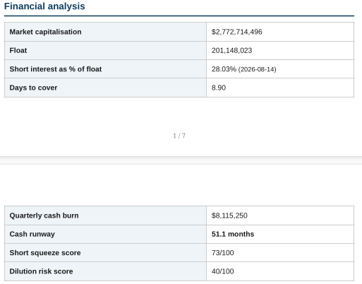
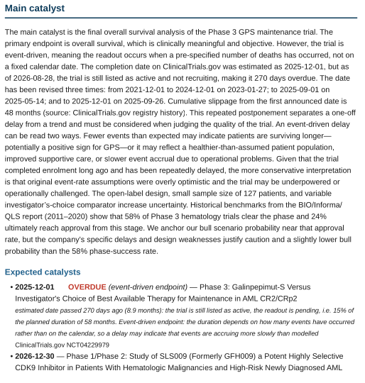
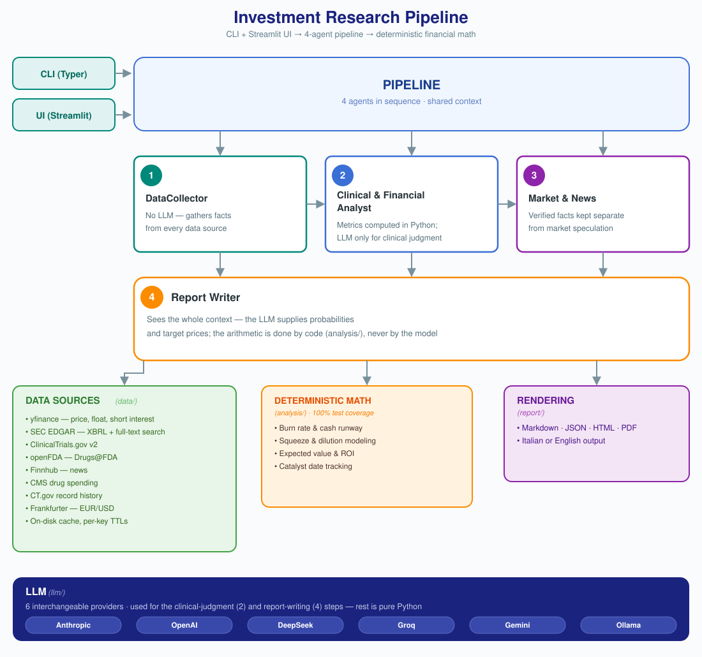

# 🧬 BioCatalyst Analyzer

A multi-agent Python application that produces due diligence reports on
biotech and pharma companies listed on NASDAQ and NYSE, focused on **near-term
clinical and regulatory catalysts**: a trial readout, an FDA decision, the
point where a company runs out of cash.

It comes from a concrete need. Small-cap biotechs move on dated, verifiable
events, but the data you need to judge them is scattered across seven different
sources, each with its own quirks. This tool collects them, computes in Python
whatever is computable, and uses a language model only where judgment is
genuinely required.

> **This is not financial advice.** See the [disclaimer](#disclaimer).

---

## What it produces

Pages from the PDF of a real report — SELLAS Life Sciences (`$SLS`),
generated in English.

**Header, data quality warnings and clinical pipeline.** Every asset in the
pipeline is listed with its NCT identifier, so each claim can be checked
against the registry.



**Financial analysis.** Burn rate and cash runway are computed from SEC XBRL
filings, never asked of the language model. Each figure carries the date it
refers to.



**Main catalyst.** This is where the measured data does the work: the trial is
270 days past its estimated completion date, and the registry history shows
the date was revised three times for a cumulative 48-month slip — a fact that
separates a one-off delay from a trend. The historical phase-success rate sits
beside the model's own probability so the two can be compared.



The full report covers the clinical pipeline, an analysis of the main
catalyst, three probability-weighted scenarios, acquisition likelihood, a
trading strategy, and an explicit list of the data it could **not** retrieve.
Exportable to Markdown, JSON, HTML and PDF, in **English or Italian**. Every
string the code itself produces — source labels, metric notes, warnings — is
localized too, so an English report contains no Italian leftovers.

---

## Architecture



Four agents run in sequence over a shared context. The split is deliberate:
everything computable is computed in Python, and the language model is asked
only for clinical judgment and for writing the report — never for arithmetic.

Any of the six LLM providers can be swapped from the `.env` file alone, and a
different model can be set per agent, so you spend where reasoning actually
matters.

---

## Installation

Requires [uv](https://docs.astral.sh/uv/) (it manages the Python version too).

```bash
git clone <repo-url> && cd biocatalyst-analyzer
uv sync

cp .env.example .env      # then fill in .env, see below
uv run pytest             # 469 tests, everything should be green
```

### Minimum configuration

Two things are needed in `.env` to get started:

```bash
# 1. An LLM provider (any one of the six)
DEFAULT_PROVIDER=deepseek
DEEPSEEK_API_KEY=sk-...

# 2. A User-Agent for the SEC, which requires a real contact address
SEC_EDGAR_USER_AGENT=BioCatalystAnalyzer your@email.com
```

Optional but recommended: `FINNHUB_API_KEY` (free sign-up at
[finnhub.io](https://finnhub.io/register)) for company news. Without it
everything else still works and the report declares the source as unavailable.

**Different models for different agents**, so you spend where it matters:

```bash
AGENT_ANALYST_MODEL=deepseek-v4-pro     # clinical judgment: needs reasoning
AGENT_NEWS_MODEL=deepseek-v4-flash      # summarizing headlines: fast is enough
AGENT_WRITER_MODEL=deepseek-v4-pro      # the final report
```

---

## Usage

### Command line

```bash
# Full due diligence: writes md, json and pdf into reports/ENSC/
uv run biocatalyst analyze ENSC

uv run biocatalyst analyze ENSC --language en --formats md,pdf
uv run biocatalyst analyze ENSC --output ~/Documents/report.pdf

# Side-by-side comparison, sorted by expected return
uv run biocatalyst compare ENSC MRNA VRTX

# Screening for new opportunities
uv run biocatalyst screen --max-price 10 --catalyst-window 6
uv run biocatalyst screen --risk speculative   # doesn't penalize likely dilution
```

### Web interface

```bash
uv run streamlit run src/biocatalyst/app.py
```

### Docker

```bash
docker build -t biocatalyst-analyzer .
docker run --rm -p 8501:8501 --env-file .env \
    -v "$PWD/reports:/app/reports" biocatalyst-analyzer

# or the CLI
docker run --rm --env-file .env --entrypoint biocatalyst \
    biocatalyst-analyzer analyze ENSC
```

---

## Design decisions

The non-obvious choices, with the reasoning. Nearly all of them came from
something that surfaced while **running** the code against the real APIs, not
from a prediction.

| Decision | Why |
|---|---|
| **The model never does arithmetic** | `ReportDraft` — the schema the LLM fills in — contains no computed field at all: no percentage changes, no expected value, no ROI. The rule isn't left to a prompt instruction, it's made structurally impossible to violate. A test asserts this against the schema |
| **SEC: XBRL APIs, not filing parsing** | `companyfacts` already returns cash, R&D and net income as dated numbers. But facts must be filtered by **duration** (`end - start`), not by the `fp` field: under the same `fp="Q2"` both the quarter and the six-month cumulative coexist, and using `fp` doubles the figures |
| **An overdue trial is not a finished trial** | Found while testing SLS (SELLAS): the Phase 3 REGAL trial had an *estimated* completion date 268 days in the past but a status of `ACTIVE_NOT_RECRUITING`. Filtering it out as "past" made the asset that actually explains the valuation disappear from the report. An **estimated** past date on an active trial means overdue — potentially the most imminent catalyst of all; an **actual** past date means it really happened |
| **Event-driven endpoints detected from the outcome text** | A survival-endpoint trial closes when a set number of events has occurred, not on a date. A delay may mean events are accruing more slowly than modeled — a meaningful reading, not a certainty. The delay is also sized against the planned duration, and the model is asked to weigh it against the control arm's historical median survival rather than dismissing it as ambiguous |
| **The non-root user is created before installing dependencies** | A `chown -R /app` after `uv sync` duplicates the whole virtual environment into a new layer: 547 MB wasted out of 1.71 GB. Creating the user first and using `COPY --chown` brought the image down to 995 MB |
| **R&D expense carries no sign constraint: the SEC holds negative values** | Lineage Cell Therapeutics tagged every R&D expense from 2009 to 2011 with a minus sign — a filer's sign convention, verified against the original XBRL fact. Tax credits and partner reimbursements also show up legitimately as a negative cost. The constraint on cash stays: a negative cash balance does not exist |
| **`ValidationError` is translated to `DataParseError` at every provider boundary** | The real defect was not the wrong constraint but that unexpected data from **one** company out of the 175 scanned could halt the entire screen. A value outside our constraints is the source's problem, not a bug of ours, and is handled like any other source failure: the screen skips that stock and carries on. A test checks that no public provider method is left unguarded |
| **Prompts are written in the report's language, not always in Italian** | The SLS PDF came out half English, half Italian. The system prompt said "write in English" while the entire user message was in Italian — headings, data labels, closing instructions — and the model sometimes followed the message rather than the instruction. Answer caching then froze the wrong choice. The prompt scaffolding now lives in `agents/prompt_text.py` in both languages, with the same cross-language parity tests already used for `i18n.py` |
| **Risk profiles carry stable English internal names** | `speculative` / `balanced` / `prudent` used to be Italian and showed up that way in the English screening menu. The internal name is what `--risk` accepts; a separate lookup provides the translated label |
| **LLM answers are cached, which is what makes a report reproducible** | Regenerating the same report gave different numbers: two SLS analyses hours apart, same data, produced expected values of +19.1% and −27.8%. The cache key is a fingerprint of the whole prompt, and the prompt contains the collected data — so if the data changes the report is rebuilt, and if it does not, the answer is the same one. It costs nothing; it saves money |
| **`temperature=0` and `seed` are not enough** (measured, not assumed) | The obvious fix does not work. The DeepSeek API accepts both parameters but does not honor them on its reasoning models: across identical calls the bull probability came back 0.70 / 0.15 / 0.55 — as dispersed as the default. The plumbing is implemented anyway, since it is correct and other providers do honor it, but the real remedy is the cache |
| **`generated_at` reports how old the data actually is** | The field always said `now()`, so a report built on yesterday's filings presented itself as freshly gathered. With answer caching that became the norm rather than the exception, so the cache now remembers when the oldest served value was written and the collector uses that |
| **A trial's postponement history, from the CT.gov record archive** | "268 days overdue" does not say whether it is the first time or the fourth — two different stories the model had no way to tell apart. The registry keeps every revision of a record. Verified on REGAL: the date moved from 2021-12 to 2025-12 across **three postponements, 48 months**. The endpoint is internal rather than part of the documented v2 API, so any error there means "history unavailable" and never blocks the analysis |
| **Historical phase-success rates as an anchor for the scenario probabilities** | Those probabilities are the least grounded number in the report and the one expected value is computed from, yet the model picked them with no reference at all. The historical phase-transition rate now sits beside them. **This is the one figure in the project that does not come from a queryable source**: it is literature (BIO/Informa/QLS, data through 2020) transcribed by hand, and the report always cites source and year |
| **A list of unverified figures at the end of the report** | The prose mixes measured numbers with numbers the model remembers ("historical median OS is 6–12 months"), printed identically and so apparently equally solid. Figures with no match in the collected data are now listed separately. Measured on SLS: **a single flag**, a genuine one. It is a net rather than a guarantee — among 150+ known values a figure can coincide by chance — and the report says so |
| **The comparator's price is verified against CMS data, not left to the model** | The TAM estimate was the only part of the report resting entirely on the model's memory. CMS publishes actual Medicare spending per drug, including average annual spend per beneficiary. The model now picks *which* drug is the right comparator — a domain judgment — and the system verifies its price. On SLS the model quoted a $240–300k list price for Onureg; the CMS figure is **$129,238**, about half. If the drug is absent from Medicare data the field stays null and the report says so |
| **A chain of alternative XBRL concepts** | Ensysce uses `NetIncomeLoss` through 2021 and `ProfitLoss` from 2022. With a single concept, net income was missing on 34 periods out of 34, making burn rate impossible to compute |
| **Burn rate from net income, not from the cash decline** | Between Q3 and Q4 2025 Ensysce's cash *rises* because of a capital raise: measuring the cash decline would report "negative burn" while the company was in fact burning cash |
| **Risk scores are `float \| None`, never 0** | A zero reads as "no risk" rather than "not computable", and for micro-caps short interest data is often missing entirely |
| **Thin cash is flagged, not penalized** | Dilution is not failure: a heavily discounted stock that raises capital and then posts positive data can still multiply. Penalizing it in the ranking discarded exactly the asymmetric opportunities. There is a genuinely fatal tail though — cash gone with no access to capital means the trial stops — and that is stated separately |
| **Streaming on by default** | Streamlit Community Cloud cuts outbound HTTP responses at ~60s and the writer agent takes 146. A thread doesn't help: it doesn't make the response any shorter. Streaming does — measured on a reasoning model, the longest gap between chunks was 0.7s |
| **Finnhub, not NewsAPI** | NewsAPI's free tier forbids use outside a development environment, even non-commercially: incompatible with a deployed app |
| **Screening universe from SEC company data** | Finviz has no stable free API. `browse-edgar` by SIC code yields 673 biotech companies, 175 of them listed on NASDAQ/NYSE |
| **Staged screening, LLM only on the finalists** | Running the full analysis on 175 companies would mean hundreds of paid calls to find five. A single call produces the rationale for every finalist at once |
| **Retry centralized, SDK retries disabled** | Leaving both on multiplies attempts: 3 × 2 = 6 paid calls instead of 3 |

---

## Stated limitations

A report always says what it could **not** find out. The same applies to the
tool itself:

- **Short interest is 2–3 weeks old** at any source: FINRA measures it twice a
  month. The report always shows the reference date.
- **Burn rate is an approximation**: it includes non-cash items (warrant
  revaluation, share-based compensation). Exact operating cash burn would
  require the cash flow statement, which the XBRL APIs do not expose.
- **Orphan drug designations are not covered**: openFDA does not expose them
  and the only official source is a web form with no API.
- **ClinicalTrials.gov does not distinguish Phase 2b from Phase 2**, so the
  phase filter is necessarily coarse.
- **Catalyst dates are often sponsor estimates** and slip; the report says so
  next to every date.
- **yfinance states "personal use only"** in its terms.
- EUR/USD currency risk is not modeled: the math is done in dollars.
- **The historical success rates are the one figure not taken from a live
  source.** No free, queryable source publishes phase-transition rates, so
  `analysis/base_rates.py` holds literature values transcribed by hand
  (BIO/Informa/QLS, data through 2020). The report always prints the source and
  year next to the number so a reader can check it against the publication.
- **The trial revision history uses an internal CT.gov endpoint** (`/api/int/`),
  not the documented v2 API. It works today, verified on several trials, but it
  can change without notice: any error there means "history unavailable" and
  never blocks the analysis.
- **Caching makes a report reproducible, not the model's judgment stable.** Two
  runs on the same data give the same report. Two runs that re-query the model
  do not: measured on SLS at a near-flat price, three fresh runs returned
  SELL / HOLD / HOLD with expected values between −32.8% and −5.0%. The spread
  comes from the bull-case target price, not from the probabilities.

---

## Development

```bash
uv run ruff check . && uv run ruff format --check .
uv run mypy src
uv run pytest
```

469 tests. The calculation layer (`analysis/`) is covered at **100%**: those
are the numbers people make decisions on, and an error there would not be
flagged by any API. External calls are mocked with `respx`; no test touches
the network.

Layout under `src/biocatalyst/`: `config` · `llm` · `models` · `data` ·
`analysis` · `agents` · `report` · `screening` · `cli` · `app`.

---

## Disclaimer

This tool produces **informational content only**, generated in part by
language models and from public data sources. **It does not constitute
financial advice, an investment recommendation, or an invitation to invest.**

Language models can be wrong, and free data sources can be incomplete or out
of date. Always verify every figure against primary sources before making any
decision. Use at your own risk.
